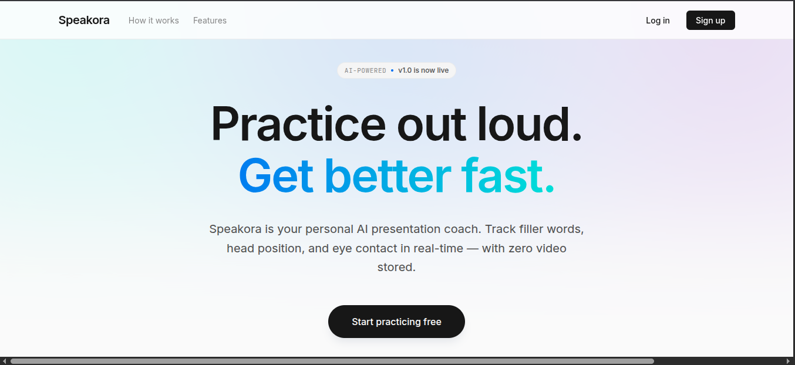

<div align="center">

# Speakora

**Turning nerves into presence.**

[](https://www.djangoproject.com/)
[](https://groq.com/)
[](https://ai.google.dev/edge/mediapipe/solutions/vision/face_landmarker)
[](https://tailwindcss.com/)
[](https://www.pythonanywhere.com/)

[Try Speakora](https://speakora.pythonanywhere.com) &nbsp;·&nbsp; [Report a Bug](https://github.com/gsraj0301/Speakora/issues)

</div>

---

## 📖 The Story

I built Speakora because I watched too many friends — smart people with good ideas — bomb presentations they'd spent weeks preparing. The problem wasn't content. It was delivery.

They'd race through slides, say "um" forty times, stare at the floor, and have no idea they were doing it. There was no mirror. No feedback loop. Just the embarrassed walk back to their seat.

Speakora is that mirror. A webcam-based coach that watches you practice, catches your filler words, tracks your face and posture, and tells you what to fix — no video ever stored, no recordings uploaded, no judgment.

---

## ✨ Features

- **Filler word detection** — counts every "um," "uh," "like," "you know" so you know which crutch words to cut
- **Pace tracking** — measures words per minute in real time
- **Head position analysis** — MediaPipe FaceLandmarker tracks nose angle, forward lean, and rotation; scores your posture
- **Eye contact tracking** — iris landmarks (468/473) detect whether you're looking at the camera
- **Facial expression** — smile percentage and blink rate measured from lip and eyelid landmarks
- **AI coaching feedback** — one click sends your stats to Groq LLM for actionable tips spoken back via TTS
- **Progress dashboard** — Chart.js charts show filler count, pace, head position, smile, and blink trends over time
- **Face skeleton toggle** — clean cyan wireframe by default; toggle to see your raw webcam feed

---

## 🛠️ Tech Stack

| Layer | Technology |
|---|---|
| **Backend** | Django 4.2, SQLite, Python 3.10+ |
| **Frontend** | Tailwind CSS (CDN), vanilla JS |
| **Face Tracking** | MediaPipe Tasks Vision 0.10.18 (CDN) — FaceLandmarker (478 landmarks) |
| **Speech-to-Text** | Groq Whisper (`whisper-large-v3-turbo`) |
| **Coaching AI** | Groq LLM (`openai/gpt-oss-120b`) |
| **Charts** | Chart.js 4.4 (CDN) |
| **Auth** | Django auth (`auth_user` table) |
| **Deployment** | PythonAnywhere via REST API |

---

## 📍 The Process

The core idea was simple: let someone practice a presentation in their browser and get useful feedback without jumping through hoops.

**Why FaceLandmarker instead of Pose?** The full-body Pose model gave us rough head tracking from nose and ear landmarks. Migrating to FaceLandmarker gave us 478 facial landmarks — iris tracking for real eye contact detection, eyelid distance for blink counting, mouth corners for smile detection, and lip distance for mouth openness. Every metric became more precise.

**Why Groq over OpenAI?** Speed. Groq's free-tier inference is noticeably faster, which matters when you're waiting for feedback after a practice run. The `openai/gpt-oss-120b` model handles ~500 tok/s with 90% MMLU — plenty of quality for coaching advice.

**Why a face skeleton by default?** Watching yourself on video makes most people more self-conscious, not less. A clean cyan wireframe gives you body awareness without the cringe. There's a toggle if you want the raw feed.

**The 15-second guard.** Sessions under 15 seconds skip the AI call entirely — not enough data to analyze. You get a friendly nudge to keep talking.

**On-demand transcription.** Audio records the full session but only transcribes when you hit Get Feedback. Saves Groq API quota and keeps the pipeline snappy.

---

## 📸 Preview



---

## 🚀 Running Locally

```bash
git clone https://github.com/gsraj0301/Speakora.git
cd Speakora
python -m venv venv && source venv/bin/activate
pip install -r requirements.txt
python manage.py migrate
python manage.py runserver
```

Set `GROQ_API_KEY` and `DJANGO_SECRET_KEY` in `.env`.

---

<div align="center">

Built with care by Raj G.

</div>
