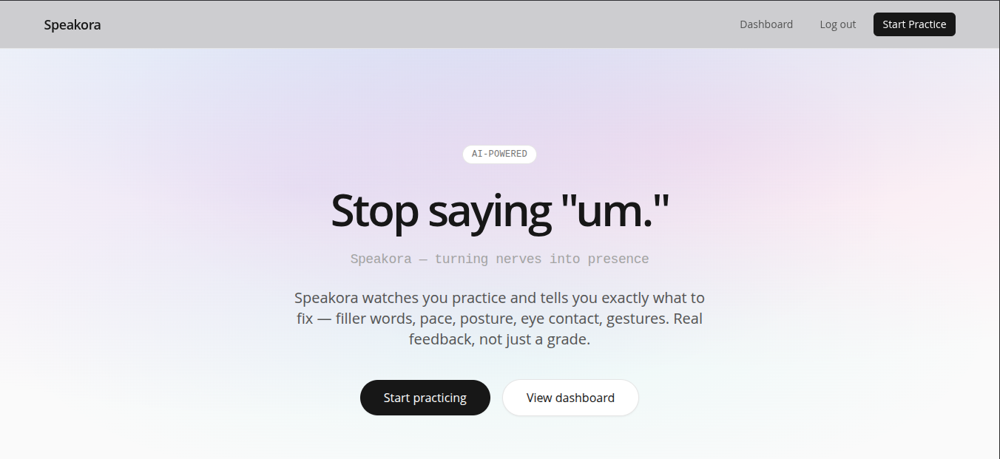

<div align="center">

# Speakora

**Turning nerves into presence.**

[](https://www.djangoproject.com/)
[](https://groq.com/)
[](https://ai.google.dev/edge/mediapipe/solutions/vision/pose_landmarker)
[](https://tailwindcss.com/)
[](https://www.pythonanywhere.com/)

[Try Speakora](https://yourusername.pythonanywhere.com) &nbsp;·&nbsp; [Report a Bug](https://github.com/yourusername/speakora/issues)

</div>

---

## 📖 The Story

I built Speakora because I watched too many friends — smart people with good ideas — bomb presentations they'd spent weeks preparing. The problem wasn't content. It was delivery.

They'd race through slides, say "um" forty times, stare at the floor, and have no idea they were doing it. There was no mirror. No feedback loop. Just the embarrassed walk back to their seat.

Speakora is that mirror. A webcam-based coach that watches you practice, catches your filler words, tracks your posture, and tells you what to fix — no account needed to start, no recordings stored, no judgment.

---

## ✨ Features

- **Filler word detection** — counts every "um," "uh," "like" so you know which crutch words to cut
- **Pace tracking** — measures words per minute in real time
- **Posture analysis** — MediaPipe tracks your skeleton; catches shoulder tilt and neck angle
- **Eye contact tracking** — estimates head rotation from nose and ear landmarks
- **Gesture & openness metrics** — detects hand movement and arm openness
- **AI coaching feedback** — one click sends your stats to Groq LLM for actionable tips spoken back via TTS
- **Progress dashboard** — Chart.js charts show filler count, pace, and posture trends over time
- **Skeleton-only view** — no video feed, just a cyan skeleton on a dark gradient (toggleable to video overlay)

---

## 🛠️ Tech Stack

| Layer | Technology |
|---|---|
| **Backend** | Django 4.2, SQLite, Python 3.10+ |
| **Frontend** | Tailwind CSS (CDN), vanilla JS |
| **Pose Detection** | MediaPipe Tasks Vision 0.10.18 (CDN) |
| **Speech-to-Text** | Groq Whisper (`whisper-large-v3-turbo`) |
| **Coaching AI** | Groq LLM (`llama-3.3-70b-versatile`) |
| **Charts** | Chart.js 4.4 (CDN) |
| **Auth** | Django auth (`auth_user` table) |
| **Deployment** | PythonAnywhere |

---

## 📍 The Process

The core idea was simple: let someone practice a presentation in their browser and get useful feedback without jumping through hoops.

**Why MediaPipe instead of a second model for face tracking?** The Pose model already gives us face landmarks (nose, ears). By measuring the nose offset from the ear midpoint, we estimate head rotation well enough to catch side-reading — no Face Mesh needed.

**Why Groq over OpenAI?** Speed. Groq's inference is noticeably faster, which matters when you're waiting for feedback after a practice run. The free tier handles ~30 Whisper requests per minute and ~6,000 chat requests per day — plenty for personal use.

**Why skeleton-only by default?** Watching yourself on video makes most people more self-conscious, not less. A skeleton overlay gives you body awareness without the cringe.

**The 15-second guard.** Sessions under 15 seconds skip the AI call entirely — not enough data to analyze. The user gets a friendly nudge to keep talking.

---

## 📸 Preview



---

## 🚀 Running Locally

```bash
git clone https://github.com/yourusername/speakora.git
cd speakora
cp .env.example .env   # fill in your GROQ_API_KEY and DJANGO_SECRET_KEY
python -m venv venv && source venv/bin/activate
pip install -r requirements.txt
python manage.py migrate
python manage.py runserver
```

---

<div align="center">

Built with care by Raj G.

</div>
